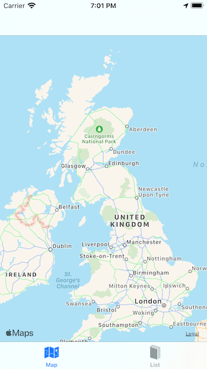
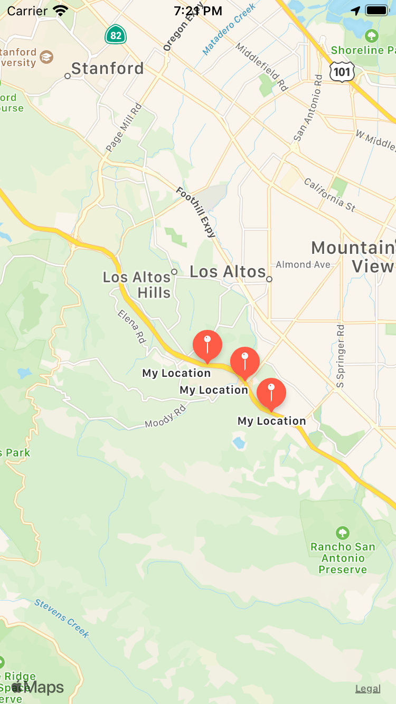

# 100 Days Of Code - Log

### Day 9: June 16th, 2020
**Today's Progress**: 
 * Add storage for the locations
  
**Thoughts:** 
 * Will be nice in the next hours to update the view to be a table view of the stored locations
   
**Link to work:** 
```bash
Cmt::Location
  - stores the latitude, longitude and time of creation

Cmt::LocationStore
  - is a singleton
  - is initialized with no locations
  - stores locations

Application 'cmt'
  - has two windows

TimerService
  - fires the timer
```


### Day 8: June 15th, 2020
**Today's Progress**:
 * Working on other priority projects.

### Day 7: June 14th, 2020
**Today's Progress**: 
 * Added tab view to be able to switch between the map and the detail
 * Add basic observable module for the timer
  
**Thoughts:** 
 * Bluetooth is not available in the simulator, so paused that until I get a dev licence
 * Look into storage for the locations.
 * Update the view to be a table view of locations
   
**Link to work:** 
 *   


### Day 6: June 13th, 2020
**Today's Progress**:
 * Read up on testing.
 
**Thoughts:**
 * Add bluetooth device scan
 * Add table view of locations (all?, past week? past two weeks?)

### Day 5: June 12th, 2020
** No progress - too many other priority commitments

### Day 4: June 11th, 2020
**Today's Progress**: 
 * Add a map view
 * Add location pin to the map view
 
**Thoughts:** 
 * Interesting watching the simulator update while tracking the freeway drive test simulation.
 * Still concerned about the test framework not behaving as expected.
 * Plan to integrate the timer and remove pins as appropriate.
   
**Link to work:** 
 *   


### Day 3: June 10th, 2020
**Today's Progress**: 
 * Successfully found various ways for the tests not to work!  
**Thoughts:** 
 * Experimented with testing but didn't get it working.  There must be some dependencies that I'm unaware of.
 As this is basically the initial spike work I'm not too worried about the missing tests.  I'll work some more on the tests very soon.
    
**Link to work:** 
 * No real progress.

### Day 2: June 9th, 2020
**Today's Progress**: 
 * Added a timer.
 * Spent too long looking into the table view and storage.
 * Spent one hour
   
**Thoughts:** 
 * Experimented with table views and storage, but didn't get it working.
 * Still thinking about the map to show the location and changes in location.
    
**Link to work:** 
 * no major change in the UI from yesterday. 

### Day 1: June 8th, 2020

**Today's Progress**: 
 * Displayed the location.
 * Simple observer so that UI updates when the location changes
 * Added button to manually update the location (superceded by the observer)

**Thoughts:** 
 * Minimal time for the project today - and started very late.
 * Decided to just push to master in these early stages.
 * Simulator has nice features for testing location.
 * Wonder if I could add a map to show the location?
 
**Link to work:** 


### Day 0: June 7th, 2020

**Today's Progress**: 
 * Forked the repo and added phase plan.
 * Updated the software `sudo motion update`. `motion --version` reports `7.5`
 * SDK out of date following the RubyMotion update - had `13.4` - updated to `13.5`
 * Read about [Test Flight](https://developer.apple.com/testflight/). Should be useful for beta testing.
 * The main object for the interaction is the [CLLocationManager](https://developer.apple.com/documentation/corelocation/cllocationmanager)
 
**Thoughts:** 
 * Looking forward to building the application.  
 * The longest journey begins with the first step.
 * Wondering if the `CLLocationManager` is the correct approach.  Will go with that for now, but the location
accuracy might not be good enough.  Considering using [IOBluetoothDeviceInquiry](https://developer.apple.com/documentation/iobluetooth/iobluetoothdeviceinquiry)
 instead.  More [reading](https://developer.apple.com/library/archive/documentation/NetworkingInternetWeb/Conceptual/CoreBluetooth_concepts/AboutCoreBluetooth/Introduction.html#//apple_ref/doc/uid/TP40013257)
  required if changing to Bluetooth approach.
 * XCode takes an age to download :-(
 * It's ruby code, but not as we know it!
 
**Link to work:** 

