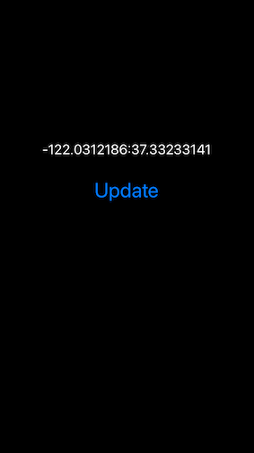
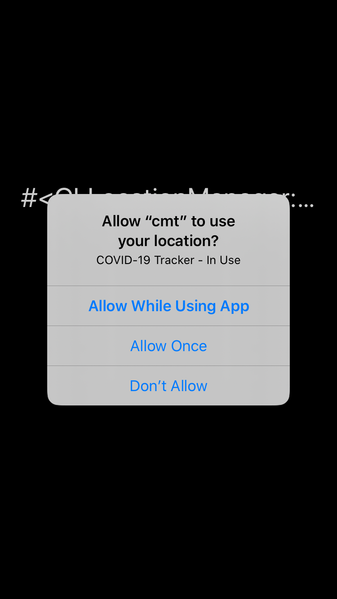

# 100 Days Of Code - Log

### Day 2: June 9th, 2020
**Today's Progress**: 
 * Added a timer.
 * Spent too long looking into the table view and storage.
 * Spent one hour
   
**Thoughts:** 
 * Experimented with table views and storage, but didn't get it working.
 * Still thinking about the map to show the location and changes in location.
    
**Link to work:** 
 * no major change in the UI from yesterday. 

### Day 1: June 8th, 2020

**Today's Progress**: 
 * Displayed the location.
 * Simple observer so that UI updates when the location changes
 * Added button to manually update the location (superceded by the observer)

**Thoughts:** 
 * Minimal time for the project today - and started very late.
 * Decided to just push to master in these early stages.
 * Simulator has nice features for testing location.
 * Wonder if I could add a map to show the location?
 
**Link to work:** 

### Day 0: June 7th, 2020

**Today's Progress**: 
 * Forked the repo and added phase plan.
 * Updated the software `sudo motion update`. `motion --version` reports `7.5`
 * SDK out of date following the RubyMotion update - had `13.4` - updated to `13.5`
 * Read about [Test Flight](https://developer.apple.com/testflight/). Should be useful for beta testing.
 * The main object for the interaction is the [CLLocationManager](https://developer.apple.com/documentation/corelocation/cllocationmanager)
 
**Thoughts:** 
 * Looking forward to building the application.  
 * The longest journey begins with the first step.
 * Wondering if the `CLLocationManager` is the correct approach.  Will go with that for now, but the location
accuracy might not be good enough.  Considering using [IOBluetoothDeviceInquiry](https://developer.apple.com/documentation/iobluetooth/iobluetoothdeviceinquiry)
 instead.  More [reading](https://developer.apple.com/library/archive/documentation/NetworkingInternetWeb/Conceptual/CoreBluetooth_concepts/AboutCoreBluetooth/Introduction.html#//apple_ref/doc/uid/TP40013257)
  required if changing to Bluetooth approach.
 * XCode takes an age to download :-(
 * It's ruby code, but not as we know it!
 
**Link to work:** 

